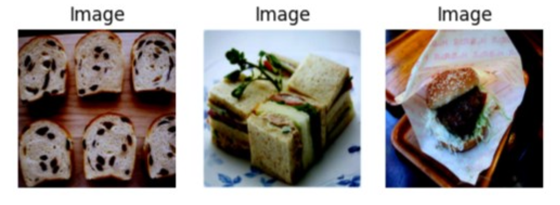
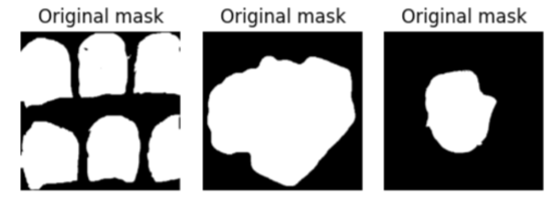
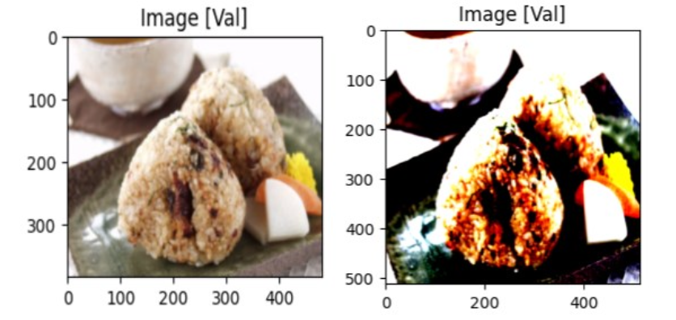
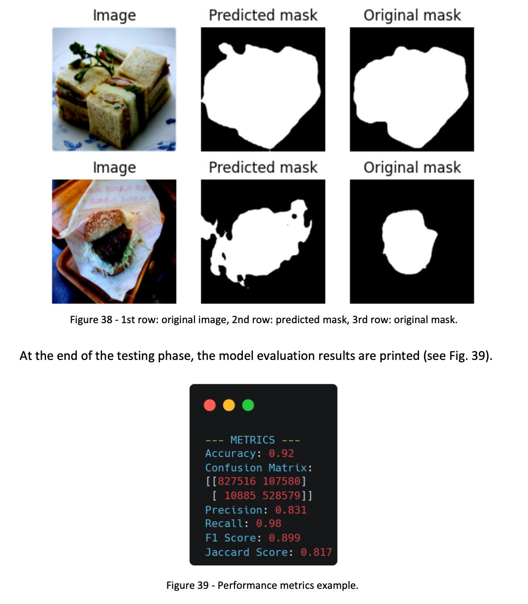
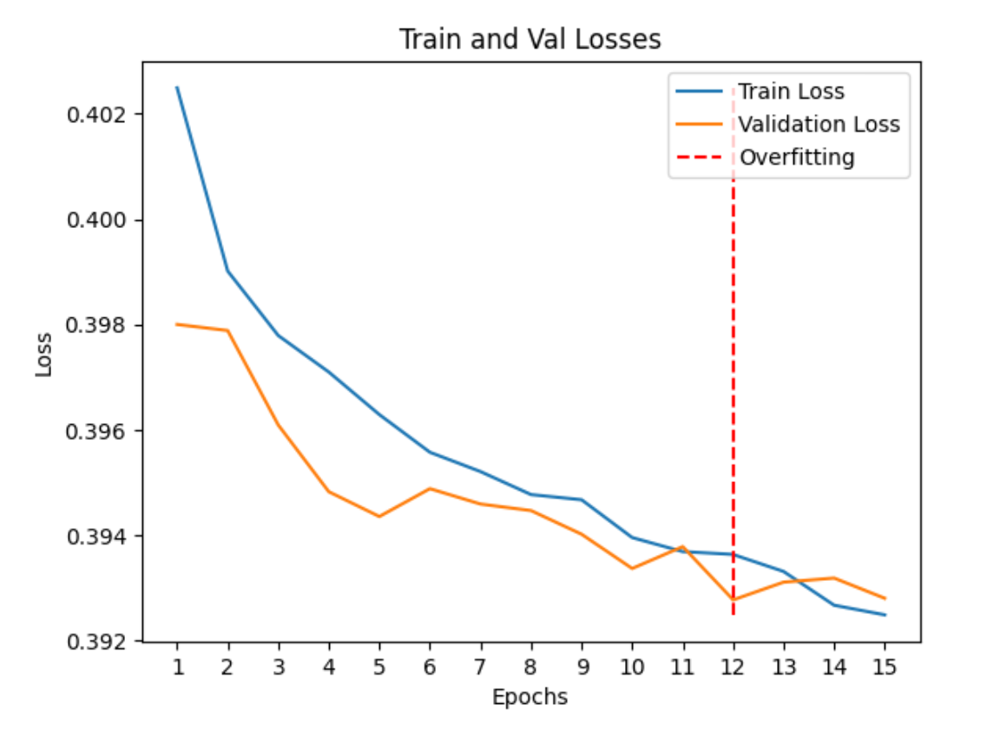
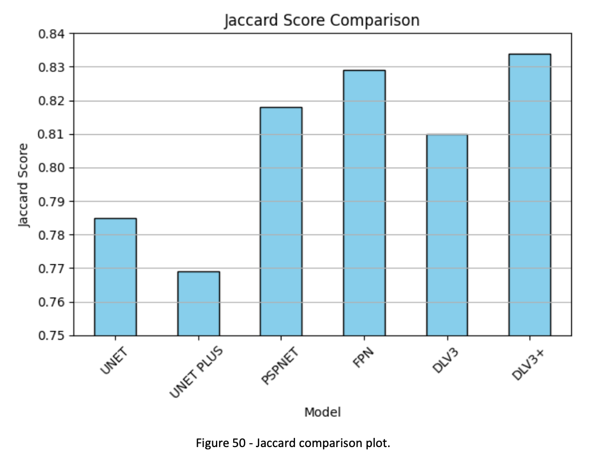
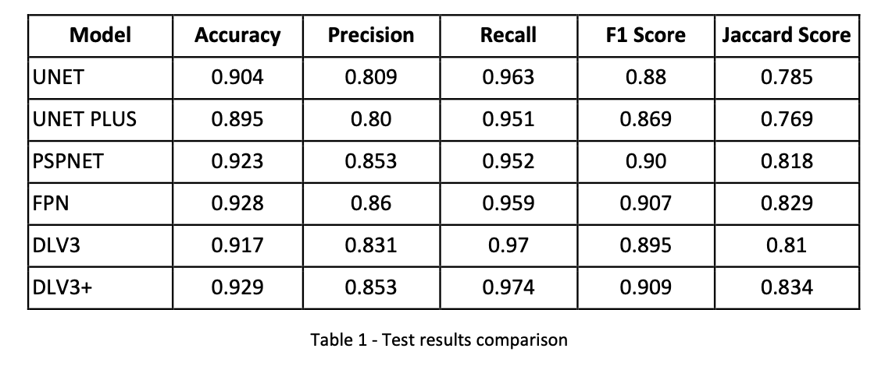
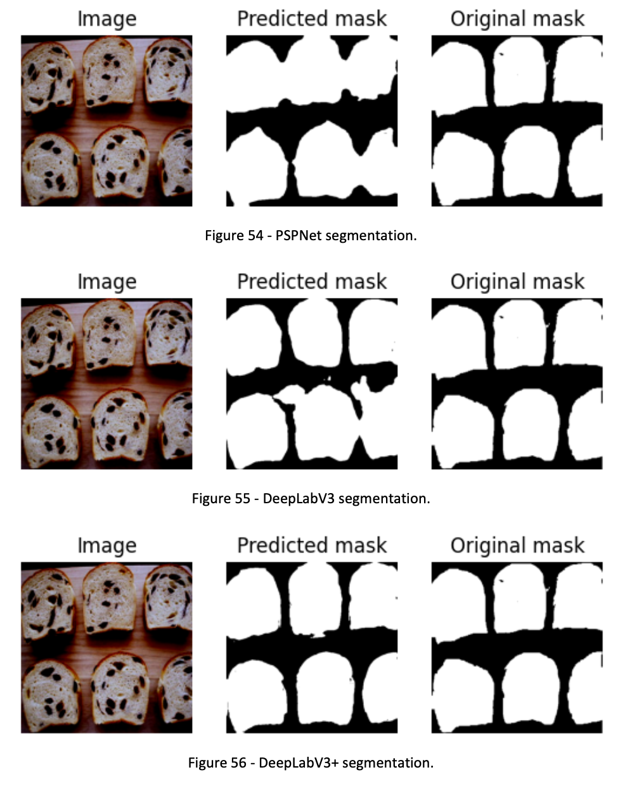

# Computer Vision Techniques for Food Segmentation

## Overview
This repository contains the implementation and comparison of deep learning models for food image segmentation. The research aims to address the challenges of segmenting food items from images, a task critical for applications such as dietary assessment, nutritional analysis, and automated meal planning.

The repository includes:
- Preprocessing pipelines for the UEC-FoodPixComplete dataset.
- Implementation of various segmentation models.
- Performance evaluation using metrics like Dice Score, Jaccard Index, Precision, and Recall.
- Visualization of segmentation results.

## Objectives
- Compare the performance of state-of-the-art deep learning models for food segmentation.
- Explore the use of pretrained ResNet34 encoders for feature extraction.
- Provide insights into the effectiveness of segmentation models in handling complex food images.

## Dataset
The **UEC-FoodPixComplete** dataset was used, featuring:
- **10,000 images** with manually refined segmentation masks.
- **103 food classes**.
- Improved segmentation accuracy through detailed preprocessing and manual corrections.

### Dataset Structure
- **Raw Images:** Original food images.

- **Segmentation Masks:** Ground truth masks for binary segmentation.

## Models
The following models were implemented and evaluated:
1. **U-Net**
2. **U-Net++**
3. **FPN (Feature Pyramid Network)**
4. **PSPNet (Pyramid Scene Parsing Network)**
5. **DeepLabV3**
6. **DeepLabV3+**

### Model Features
- **Backbone Encoder:** ResNet34 pretrained on ImageNet.
- **Loss Function:** Dice Loss for effective segmentation overlap.
- **Optimization:** Adam optimizer with early stopping to prevent overfitting.

## Tools and Frameworks
- **Python 3.8**
- **PyTorch**
- **segmentation_models.pytorch** library for model implementation.
- **Matplotlib and Seaborn** for visualizing results.
- **NumPy and Pandas** for data manipulation.

## Implementation
1. **Data Preprocessing:**
   - Resize images to 512x512.
   - Normalize pixel values.
   - Image pre-processing
  
   
   
   - Convert segmentation masks to binary format.

2. **Model Training:**
   - Train each model on the dataset for 15 epochs.
   - Apply early stopping with patience of 3 epochs.
   - Save the best-performing model checkpoint.

3. **Evaluation:**
   - Compute metrics: Dice Score, Precision, Recall, and Jaccard Index.
   - Visualize segmentation results.
   

4. **Comparison:**
   - Analyze performance across models.
   - Generate comparative plots.
   
   
   

## Results
- **Best Model:** [DeepLabV3+]
- **Comparison Table:**
  

- **Visualizations:**
  

## Folder Structure
- `data/` - Raw and processed datasets.
- `notebooks/` - Jupyter notebooks for preprocessing, training, and evaluation.
- `models/` - Trained model weights and architecture files.
- `src/` - Utility scripts for data handling and model implementation.
- `results/` - Evaluation metrics and visualizations.

## How to Use
1. Clone the repository:
   `git clone https://github.com/username/repository-name.git`
2. Install dependencies:
   `pip install -r requirements.txt`
3. Run preprocessing:
   `python src/data_preprocessing.py`
4. Train a model:
   `python src/train.py --model deeplabv3plus`
5. Evaluate results:
   `python src/evaluate.py`

## Future Work
- Extend experiments to multi-class segmentation.
- Improve model generalization for real-world applications.
- Explore transformer-based architectures for food segmentation.

## License
This project is licensed under the [MIT License](LICENSE).

## Acknowledgments
This research was conducted as part of a double-degree program between Alpen-Adria-Universität Klagenfurt and the University of Udine. Special thanks to the creators of the UEC-FoodPixComplete dataset and the open-source tools used in this project.
